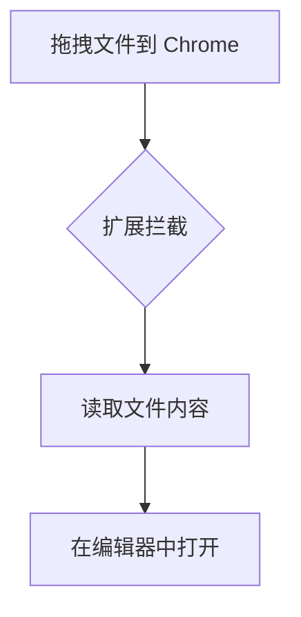

# 测试文档 - Markdown Editor

> 这是一份用于测试 Chrome 扩展功能的 Markdown 文件。

## 基本格式

**粗体** _斜体_ ~~删除线~~ `行内代码`

## 列表

- 苹果
- 橘子
- 香蕉

1. 第一步
2. 第二步
3. 第三步

## 任务列表

- [x] 完成核心编辑器
- [x] 添加 Mermaid 支持
- [ ] 拖拽文件测试

## 代码块

```python
def hello():
    print("Hello from test file!")
```

## 表格

| 名称     | 状态   | 备注      |
| -------- | ------ | --------- |
| 拖拽打开 | 测试中 | 核心功能  |
| 编辑保存 | 已通过 | Ctrl+S    |
| 主题切换 | 已通过 | 深色/浅色 |

## Mermaid 图表



## 引用

> 如果你能看到这段话被正确渲染，说明拖拽打开功能正常工作了。

---

_测试完成！_
